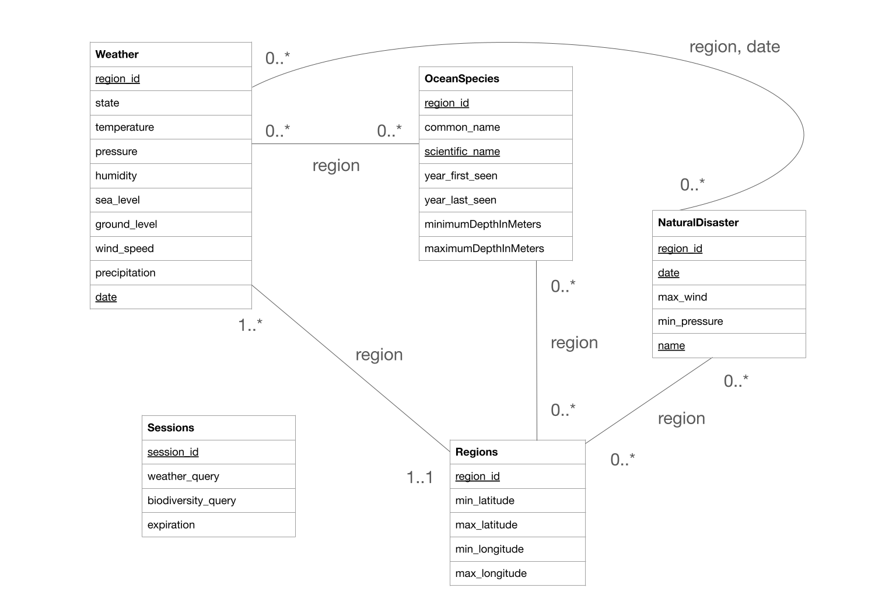
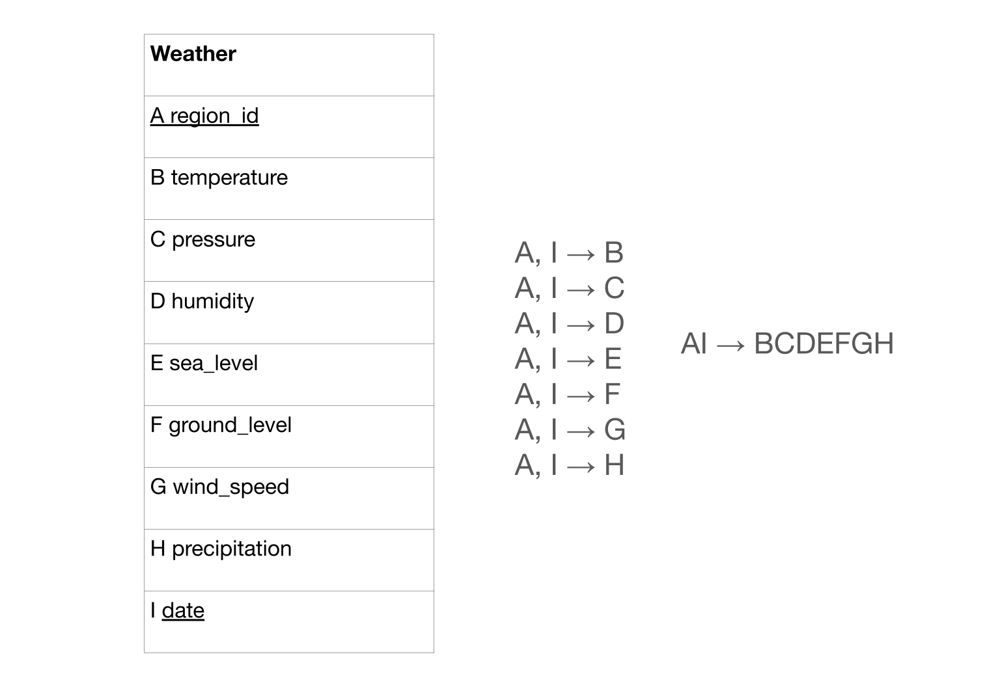
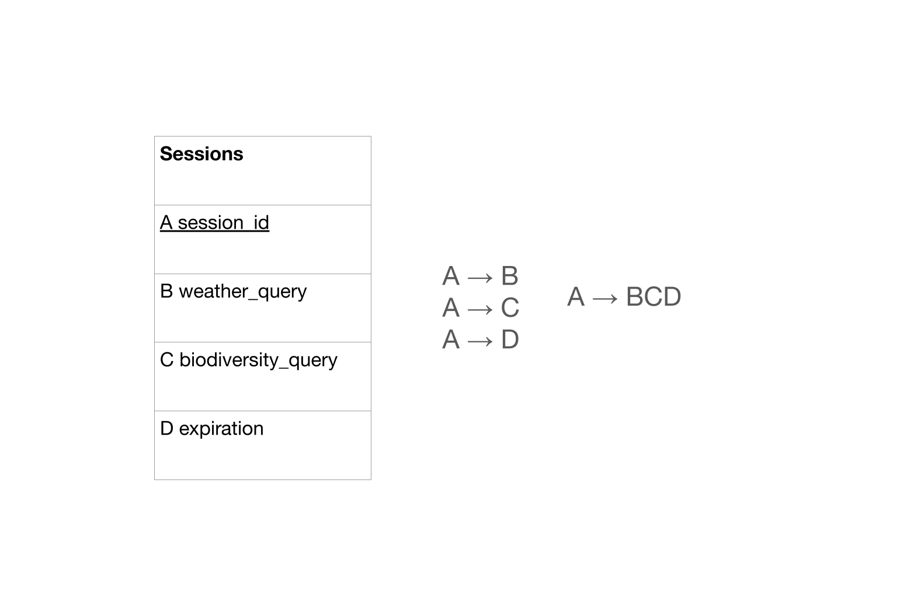
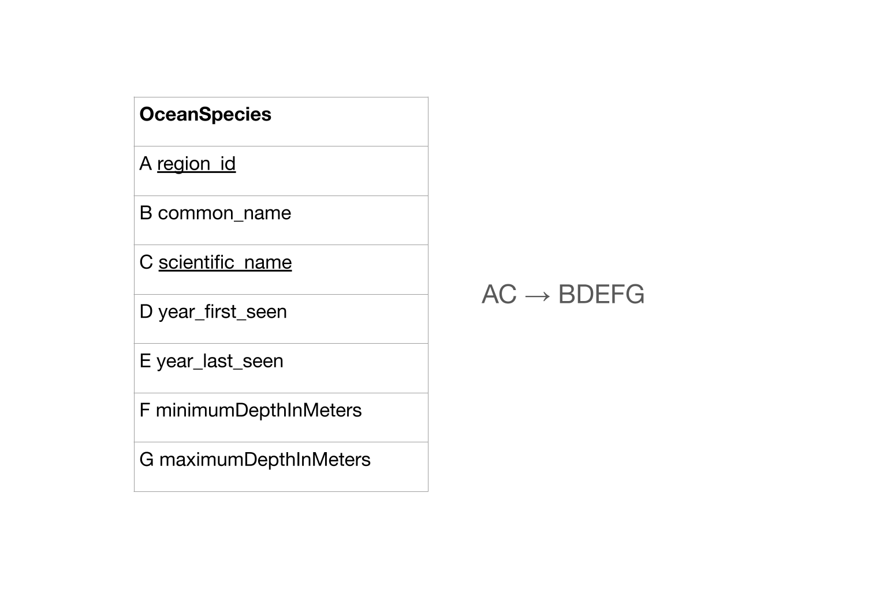
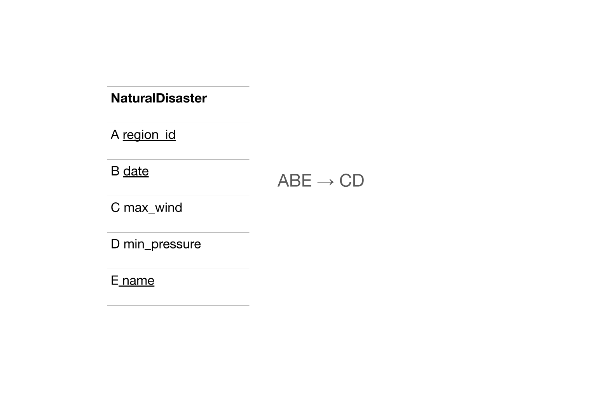
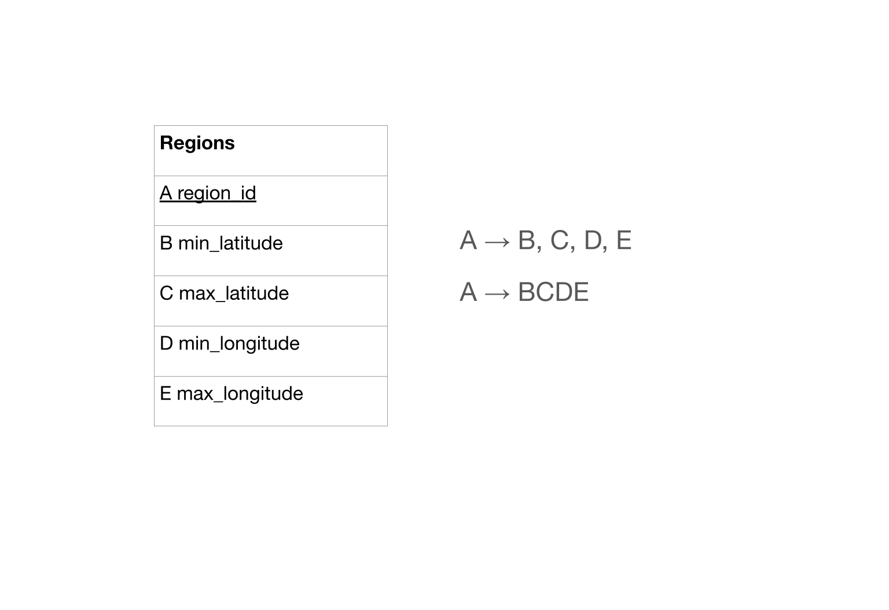

# **Database Design** *Currents*

- - -

 Table of Contents

[1. Database Design Diagram](#uml-diagram)

[2. Database Reasoning](#reasoning)

[3. Database Normalization](#3nf-normalization)

[4. Logical Design (Relational Schema)](#relational-schema)

## UML Diagram

## Reasoning

The Weather entity holds the weather data for each day in each region.  The original weather data contains data for many specific coordinates; thus, Weather entity data is aggregated for each region, as determined by the Region entity, to simplify the querying of data and limit the amount of data that we need to store. Multiple rows can have the same region_id, since the weather entity contains a separate row for each day in the region. Likewise, multiple rows can have the same date. However the combination of region and date should be unique; thus, the combination of date and region is the primary key for this entity. Since each of the attributes are weather specific it would not make sense for them to be in any of the other entities. Weather has a one-to-one relationship to Regions, since each entry in Weather maps to one Region. Weather also has a many-to-many relationship to NaturalDisaster, as each date and region combination can map to zero or more disasters.

The Sessions entity organizes the various sessions that a user starts in the application. Here, we define a single session as an input or series of inputs that the user enters in order to customize the view of the data dashboard. For this reason, we assign each session a unique session ID, serving as the primary key. Each session has an associated weather and/or biodiversity query, modeled as a string with the minimum necessary information about the input parameters to the dashboard view. Additionally, each session has an expiration, modeled as a string containing the date of expiry. The expiration attribute enables the user to look through a limited history of their previous searches, balancing usefulness with data storage requirements. The cardinality of Sessions is 4. We modeled Sessions as a separate entity due to the ability to organize a single capture of a user’s interactions with the app as a tuple, but more importantly in order to be able to retrieve a recently viewed dashboard snapshot within the date of expiry. The Sessions entity is unlinked to the other entities.

​​NaturalDisaster is a collection of data focusing on hurricanes and when they occurred and other statistics like their maximum wind speed and minimum pressure. It is modeled as its own entity because it captures unique information about hurricanes that the other tables like Weather cannot hold. In addition, not all regions in our database have had a natural disaster. The primary key of this table is the combination of region_id, date (day natural disaster occurs), and name since the occurrence of the natural disaster depends on where it occurred (region_id) and when it occurred (date) and the name identifies it. The cardinality of the relationship between NaturalDisaster and Regions is many to many. The same is true for the relationship between NaturalDisaster and Weather. The same natural disaster can occur in multiple regions based on our region_ids. Likewise, one region_id can have multiple natural disasters that occurred on different days.

Regions is an entity which contains defined regions in the coastal U.S. partitioned by a range of latitudes and longitudes. Its primary key is region_id since it contains a set boundary of latitude and longitude which does not overlap with another region_id specified. The boundaries of the region are defined by the attributes min_latitude, max_latitude, min_longitude, max_longitude. Regions has a one to many relationship with Weather since one region can have a different collection of weather metrics per date. It also has a many to many relationship with OceanSpecies as zero or more species of ocean animals can be found in one region. Regions has a many to many relationship with NaturalDisaster since multiple natural disasters could have occurred in the same region on the same dates.

OceanSpecies is a collection of data about the types of ocean species present in the US coastal regions. It contains information about a species region_id, common_name, scientific_name, year_first_seen, year_last_seen, minimumDepthInMeters and maximumDepthInMeters. As such, the cardinality of the relationship between OceanSpecies and Weather is many to many, and between OceanSpecies and Regions is also many to many. Since a species could exist in multiple different regions, both the region_id and the scientific_name are the primary keys in order to specify a specific species in an area and the additional attributes related to it. We modeled it this way because the year_first_seen, year_last_seen, minimumDepthInMeters, and maximumDepthInMeters would be specific to the species in the certain region. Therefore, in order to identify the data and distinguish between the same species in different regions, we also needed the primary key to be the region_id and the scientific_name. We decided not to include the common_name in the primary key because it is possible that a species is referred to differently depending on the region. 

## 3NF Normalization

### Weather

For Weather(A, B, C, D, E, F, G, H, I) let A = region_id, B = temperature , C = pressure, D = humidity,  E = sea_level , F = ground_level, G =wind_speed , H = precipitation , an I = date.  We have F = {AI → B, AI → C, AI → D, AI → E, AI → F, AI → G, AI → H}. Since F is a minimal basis for itself, and AI is a superkey, the relation is already in 3NF. No decomposition is required, thus Weather(A, B, C, D, E, F, G, H, I) is in 3NF.

### Sessions

We have Sessions(A, B, C, D) where A = session_id, B = weather_query, C = biodiversity_query, and D = expiration. The set of FDs for this relation is {A → B, A → C, A → D}. This is, by itself, a minimal basis. We condense these functional dependencies into A → BCD. A is a superkey; we have connected LHS with the remaining attributes. Thus the resulting 3NF decomposition is the relation with the schema S(A, B, C, D), which is our original schema. Therefore, the Sessions entity is already in 3NF.

### Ocean Species

The OceanSpecies Schema adheres to 3NF because every non-key attribute (B = species_id, D = year_first_seen, E = year_last_seen, F = minimumDepthInMeters, G = maximumDepthInMeters) depends only on the primary key (A = region_id, C = scientific_name).

The functional dependencies are {AC → B, AC → D, AC → E, AC → F, AC → G}. Therefore, the overall schema for OceanSpecies is OceanSpecies(A,B,C,D,E,F,G), which is in 3NF.

### Natural Disaster

For NaturalDisaster(A, B, C, D, E) with A = region_id, B = date, C = max_wind, and D = min_pressure, E = name. We have {ABE → C, ABE → D}, which condenses to {ABE → CD}, the minimal basis. All non-primary attributes (C and D) depending on primary key ABE. ABE is a super key, and there are no partial or transitive dependencies, so the table  NaturalDisaster(A, B, C, D, E) is in 3NF.

### Regions

For Regions(A, B, C, D, E) with A = region_id, B = min_latitude, C = max_latitude, D = min_longitude, and E = max_longitude, we have {A → B, A → C, A → D, A → E}, which condenses to {A → BCDE}. This is a minimal basis, A is a super key, and there are no partial or transitive dependencies, so the table Regions(A, B, C, D, E) is in 3NF.

### Conclusion

As we have determined above, each entity in the schema is already in 3NF; therefore, the UML diagram remains [as is](#uml-diagram).

## Relational Schema

Weather(region_id:INT [PK] [FK to Regions.region_id], temperature:Decimal, pressure:Decimal, humidity:Decimal, sea_leve:Decimal, ground_level:Decimal, wind_speed:Decimal,  precipitation:Decimal, date:VARCHAR(10) [PK])

Sessions(session_id:INT [PK], weather_query:VARCHAR(500), biodiversity_query:VARCHAR(500), expiration:VARCHAR(10))

NaturalDisaster(region_id:INT [PK] [FK to Regions.region_id], date:VARCHAR(10) [PK] , max_wind:Decimal, min_pressure:Decimal, name:VARCHAR(10) [PK])

Regions(region_id:INT:Decimal [PK], min_latitude:Decimal, max_latitude:Decimal, min_longitude:Decimal, max_longitude:Decimal)

OceanSpecies(region_id:INT [PK] [FK to Regions.region_id], common_name: VARCHAR(100), scientific_name:VARCHAR(100) [PK],  year_first_seen:INT, year_last_seen:INT, minimumDepthInMeters:Decimal, maximumDepthInMeters:Decimal)