# *Currents* | **Database Implementation and Indexing** 

<sup> Table of Contents

[Part 1](#part-1) <br/>
- [Table implementation](#implementation-of-at-least-five-main-tables)
- [DDL commands](#data-definition-language-ddl-commands)
- [1000-row requirement](#three-tables-with--1000-rows)
- [Advanced query writing](#write-advanced-queries)
- [Advanced query execution](#execute-advanced-queries)

[Part 2](#part-2) <br/>
- [Query 1 indexing](#indexing-for-query-1)
- [Query 2 indexing](#indexing-for-query-2)
- [Query 3 indexing](#indexing-for-query-3)
- [Query 4 indexing](#indexing-for-query-4)

- - -

## Part 1

### Implementation of at least five main tables

Screenshot of terminal/command line in GCP showing successful connection:

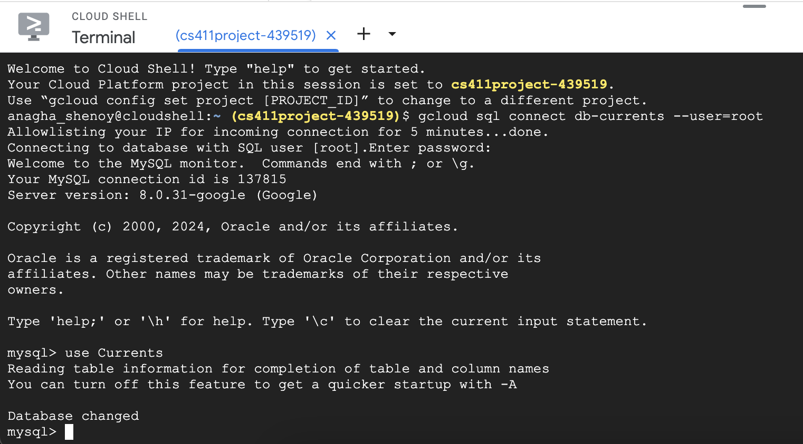

### Data Definition Language (DDL) commands

```sql
CREATE TABLE Regions (
region_id INT PRIMARY KEY, 
min_latitude DECIMAL, 
max_latitude DECIMAL, 
min_longitude DECIMAL, 
max_longitude DECIMAL); 
```

```sql
CREATE TABLE NaturalDisaster (
region_id INT, 
date VARCHAR(10), 
max_wind DECIMAL, 
min_pressure DECIMAL, 
name VARCHAR(10), 
PRIMARY KEY (region_id, date, name), 
FOREIGN KEY (region_id) REFERENCES Regions(region_id) ON DELETE CASCADE);
```

```sql
CREATE TABLE Weather(
region_id INT,
precipitation INT,
min_temperature INT,
date varchar(10),
max_temperature INT,
PRIMARY KEY (region_id, date),
FOREIGN KEY (region_id) REFERENCES Regions(region_id) ON DELETE CASCADE);
```

```sql
CREATE TABLE Sessions(
session_id INT PRIMARY KEY,
min_lat INT,
max_lat INT,
min_long INT,
max_long INT,
rerun BOOLEAN,
timestamp INT);
```

```sql
CREATE TABLE OceanSpecies (
region_id INT,
scientific_name VARCHAR(250),
year_first_seen INT,
year_last_seen INT,
minimumDepthInMeters DECIMAL,
maximumDepthInMeters DECIMAL,
PRIMARY KEY (region_id, scientific_name),
FOREIGN KEY (region_id) REFERENCES Regions(region_id) ON DELETE CASCADE); 
```

### Three tables with $\geq$ 1000 rows

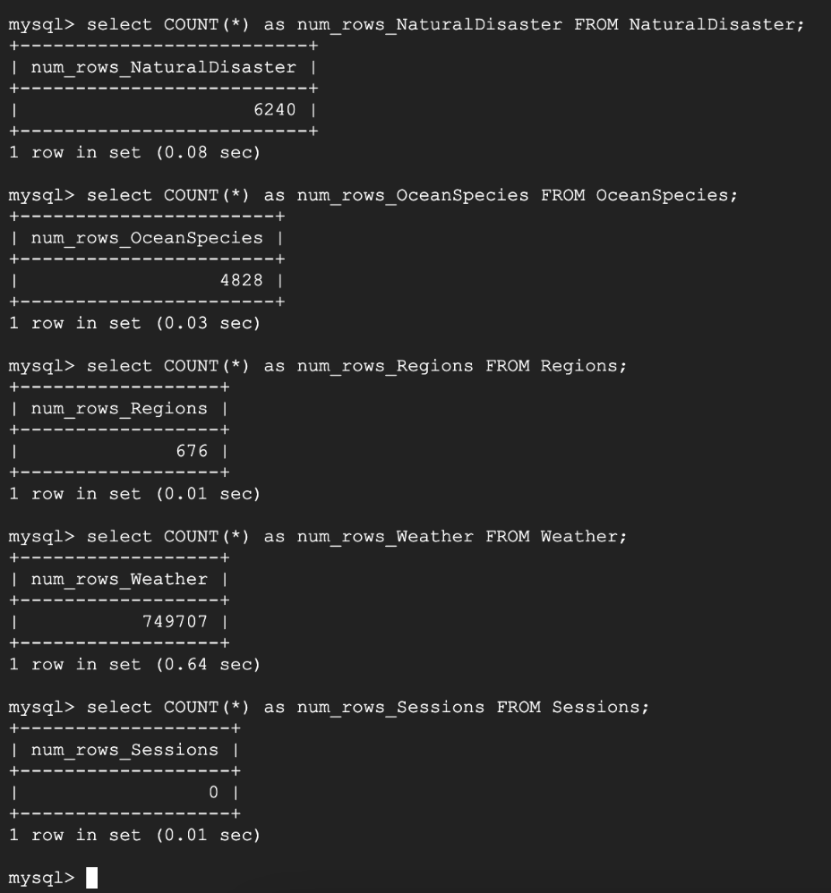

### Write advanced queries

1) **Find average weather metrics for each region during natural disasters**

```sql
SELECT Weather.region_id, Weather.date, AVG(Weather.max_temp) AS avg_max_temperature, 
       AVG(Weather.precipitation) AS avg_percipitation, 
       AVG(Weather.min_temp ) AS avg_min_temperature
FROM Weather
JOIN NaturalDisaster
ON Weather.region_id = NaturalDisaster.region_id
GROUP BY Weather.region_id, Weather.date LIMIT 15;
```

2) **Regions where the average precipitation during natural disasters is higher than the overall average precipitation across all regions**

```sql
SELECT region_avg.region_id, avg_percipitation
FROM (
    SELECT w.region_id, AVG(w.precipitation) AS avg_percipitation
    FROM Weather w
    JOIN NaturalDisaster nd ON w.region_id = nd.region_id AND w.date = nd.date
    GROUP BY w.region_id
) AS region_avg
WHERE region_avg.avg_percipitation > (SELECT AVG(precipitation) FROM Weather);
```

3) **Identify species in each region that has experienced extreme weather**

```sql
SELECT OceanSpecies.region_id, OceanSpecies.scientific_name
FROM OceanSpecies
JOIN NaturalDisaster ON OceanSpecies.region_id = NaturalDisaster.region_id
WHERE NaturalDisaster.max_wind > 80 OR NaturalDisaster.min_pressure  < 950
GROUP BY OceanSpecies.region_id, OceanSpecies.scientific_name
ORDER BY OceanSpecies.region_id;
```

4) **Find regions with a high number of natural disasters in a specified time period**

```sql
SELECT OceanSpecies.region_id, OceanSpecies.scientific_name
FROM OceanSpecies
WHERE OceanSpecies.region_id IN (
    SELECT region_id
    FROM Weather
    WHERE precipitation> 100
    GROUP BY region_id
    HAVING COUNT(*) > 5
)
ORDER BY OceanSpecies.region_id;
```

### Execute advanced queries

1) **Query 1 Result**

(First 15 rows)

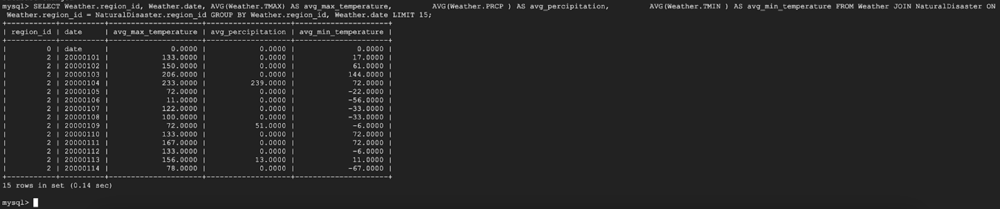

2) **Query 2 Result**

(First 15 rows)

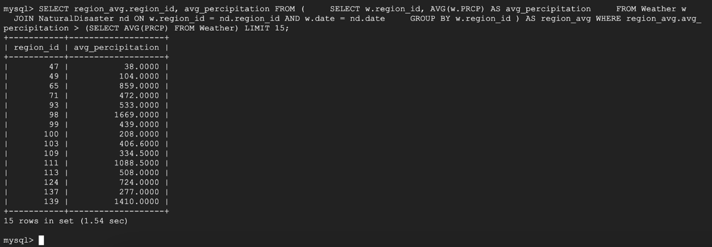

3) **Query 3 Result**

(First 15 rows)

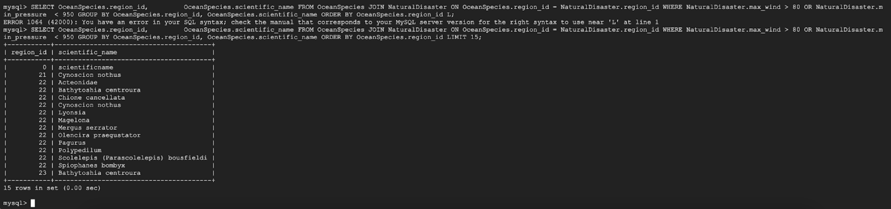

4) **Query 4 Result**

(First 29 rows)

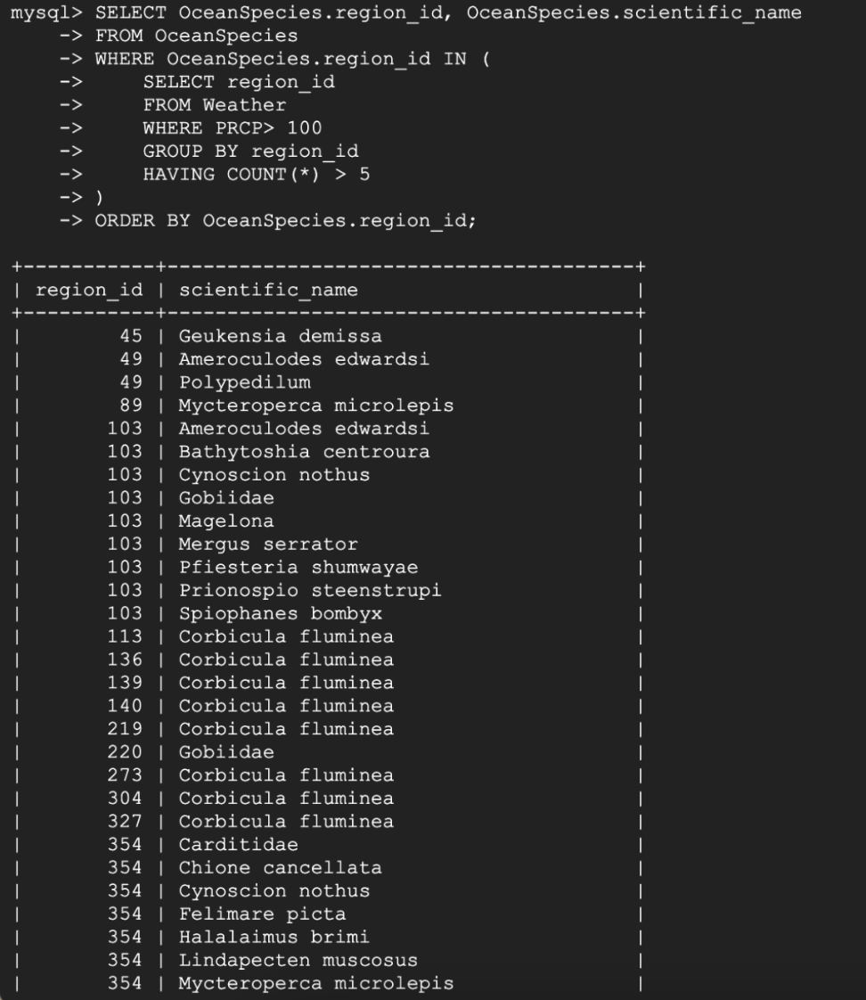

## Part 2

### Indexing for query 1

**1. Indexing analysis report for query 1:**

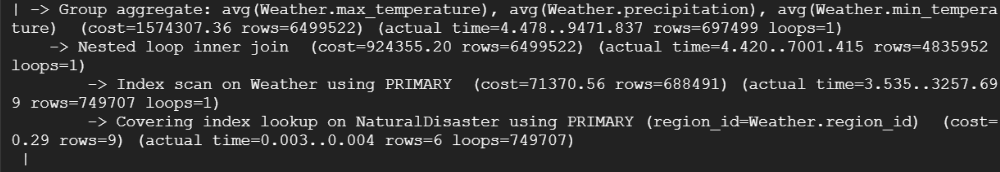

The cost of the nested inner loop join with no indexing is $924355.20$.

**2. With an index on `Weather.precipitation`:**

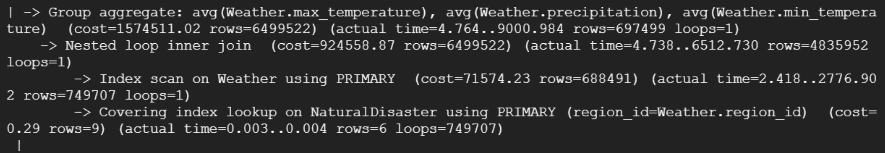

The cost of the nested inner loop join is $924558.87$.

**3. With an index on `Weather.min_temperature`:**

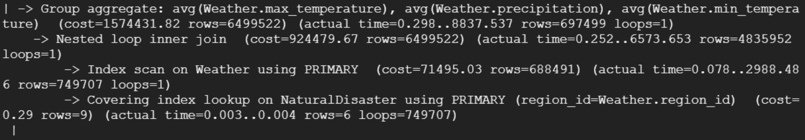

The cost of the nested inner loop join is $924479.67$.

**4. With an index on `Weather.max_temperature`:**

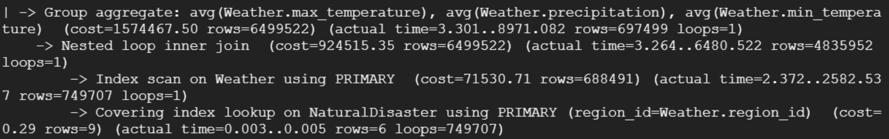

The cost of the nested inner loop join is $924515.35$.

Prior to indexing, the original cost of our query was 924355.20. The first index we tried was on precipitation for the Weather table. This increased our cost to 924558.87, which slightly reduced performance. Next we indexed on min_temperature for Weather. This gave us a cost of 924479.67, which also slightly reduced performance from the original. For our last design, we indexed on max_temperature for Weather. The cost was 924515.35 which is also reduced performance. In this case, indexing did not bring a better effect on the query’s performance. We think this occurred because the only relevant non-primary key attributes we could index on were decimal values which likely will be unique. The best index would be an attribute where multiple rows can have the same value, which is unlikely to occur for attributes with continuous values. 

### Indexing for query 2

**1. Indexing analysis report for query 2:**

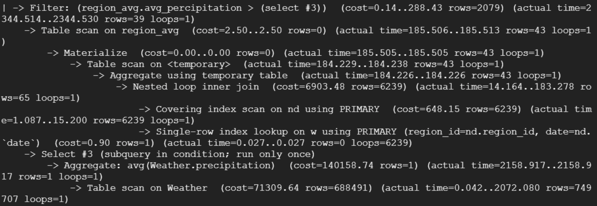

The cost of the nested inner loop join with no indexing is $6903.48$.

**2. With an index on `Weather.precipitation`:**

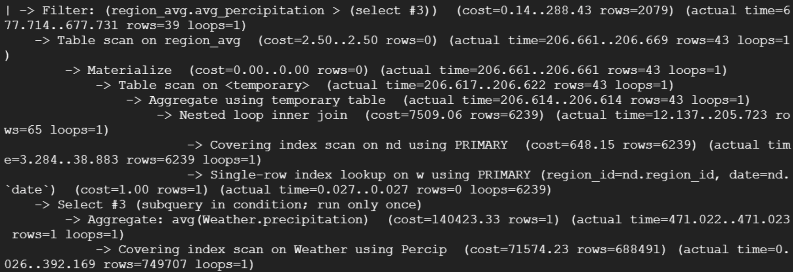

The cost of the nested inner loop join is $7509.06$.

**3. With an index on `Weather.date`:**

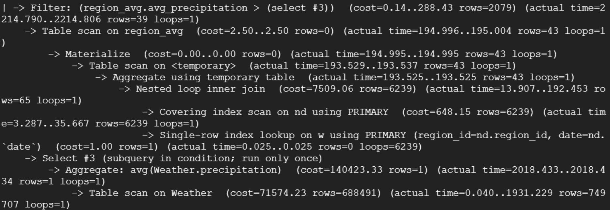

The cost of the nested inner loop join is $7509.06$.

**4. With an index on `Weather.region_id`:**

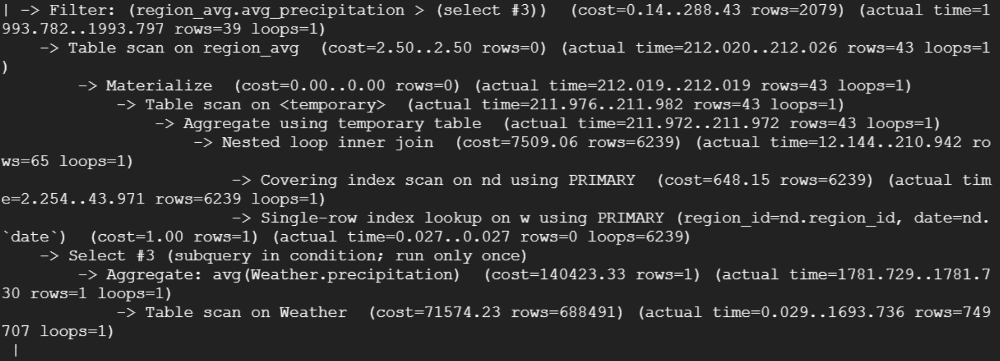

The cost of the nested inner loop join is $7509.06$.

Prior to indexing, the original cost of our query was 6903.48. The first index we tried was on precipitation for the Weather table, which increased the cost to 7509.06. Next, we indexed on date for Weather. This gave us a cost of 7509.06, which was no different than when indexing on precipitation. Finally, we indexed on region_id for Weather which once again resulted in a cost of 7509.06. Overall, indexing did not improve the query’s performance and we believe this is because the overhead of maintaining the indices outweighed any potential benefit that could be gained from indexing, especially since this query was quite complex.

### Indexing for query 3

**1. Indexing analysis report for query 3:**

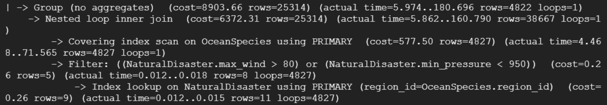

The cost of the nested inner loop join with no indexing is $6372.31$.

**2. With an index on `NaturalDisaster.max_wind`:**

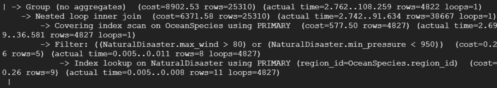

The cost of the nested inner loop join is $6371.58$.

**3. With an index on `NaturalDisaster.min_pressure`:**

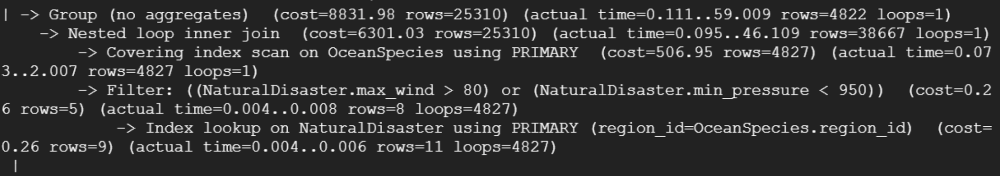

The cost of the nested inner loop join is $6301.03$.

**4. With an index on `NaturalDisaster.region_id`:**

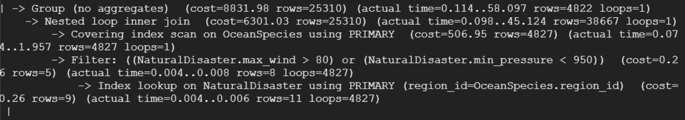

The cost of the nested inner loop join is $6301.03$.

Our final selection for index design is to use `NaturalDisaster.min_pressure` as an index. Prior to indexing, the original cost of the query was 6372.31. The first index we tried was max_wind from the NaturalDisaster entity, which slightly reduced the cost to 6371.58. The second try was indexing on min_pressure from NaturalDisaster, which reduced the cost further to 6301.03. The last choice we tried was indexing on region_id from NaturalDisaster, which also resulted in a cost of 6301.03. For this case, indexing improved the query’s performance. We theorize this is due to the min_pressure being used as a selective filter for the query in the WHERE condition.

### Indexing for query 4

**1. Indexing analysis report for query 4:**

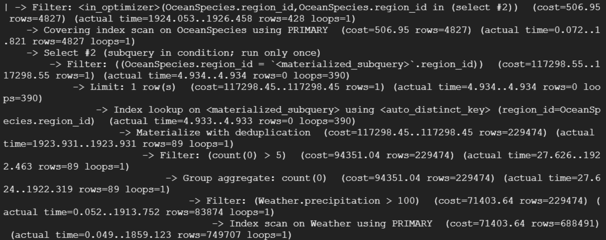

The cost of the OceanSpecies.region_id filter with no indexing is $117298.55$. The cost of the Weather.precipitation filter with no indexing is $71403.64$.

**2. With an index on `Weather.precipitation`:**

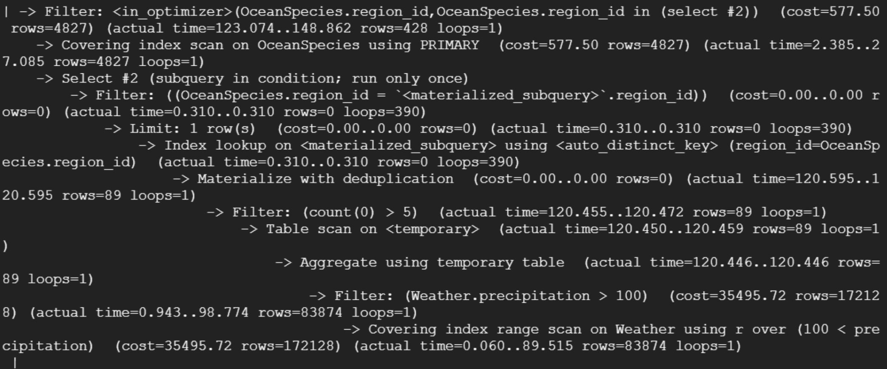

The cost of the Weather.precipitation filter is $35495.72$.

**3. With an index on `OceanSpecies.region_id`:**

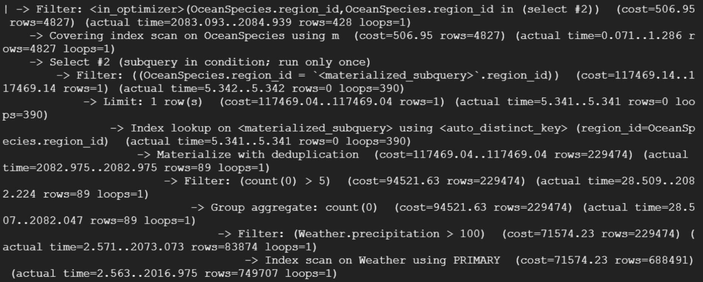

The cost of the OceanSpecies.region_id filter is $117469.14$.

**4. With an index on `OceanSpecies.scientific_name`:**

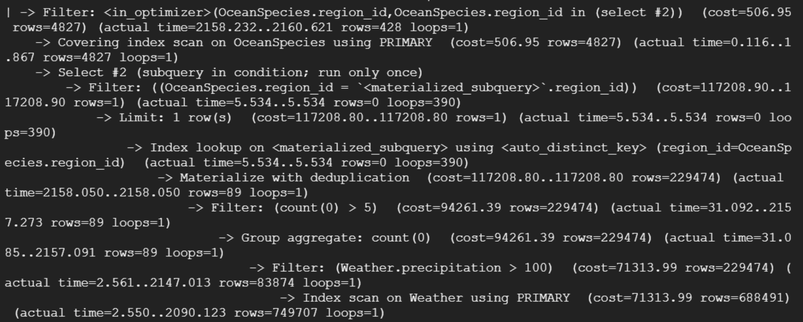

The cost of the OceanSpecies.region_id filter is $117208.90$.

Our final selection for index design is to use `Weather.precipitation` as an index. Prior to indexing, the original cost of the query was high at 117298.55 from the perspective of the OceanSpecies.region_id filter, and 71403.64 from the perspective of the Weather.precipitation filter. Indexing on precipitation from the Weather table resulted in an improved performance at a cost of 35495.72 for the precipitation filter. Indexing on region_id and scientific_name from OceanSpecies resulted in slight deviations from the original cost for the region_id filter, at 117469.14 and 117208.90, respectively. For this case, indexing improved the query’s performance. We theorize this is due to precipitation being used as a selective filter for the query in the WHERE condition. Additionally, since the Weather table contains more data, index attributes from the Weather table are able to improve performance significantly.