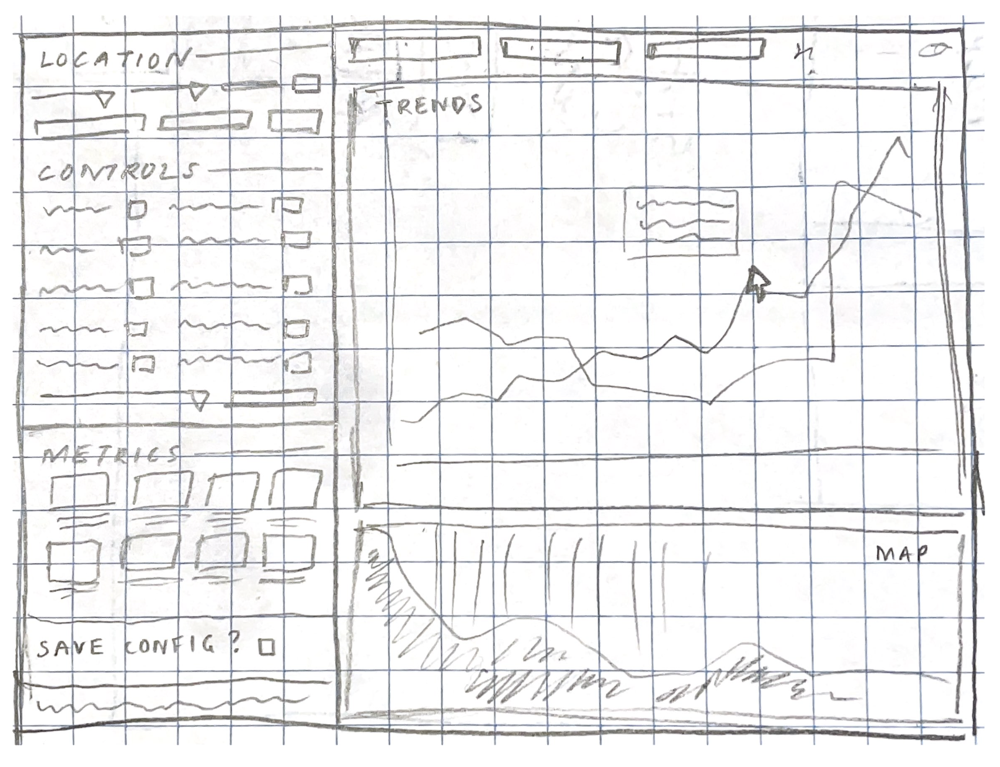

# **Project Title:** *Currents*

Mutma A. (adebayo5), Maciek H. (mhryc3), Anagha S. (anaghas2)	, Aishwarya P. (apasham2)

- - -

## Project Summary: 

*Currents* will be an innovative weather and marine data dashboard designed to revolutionize data visualization for meteorologists and marine scientists. The platform will offer an interactive experience, enabling users to explore both historical and projected weather trends, along with essential weather and atmospheric metrics, delivering deeper insights for climate analysis and forecasting.

## Description:

The goal of our project, *Currents*, is to create a dashboard that will allow users to explore meteorological and marine data with insightful visualizations that highlight historical and forecasted weather trends. The scope of this project is focused on providing analytics for the U.S. as there is abundant oceanic and atmospheric data across the country that can be used for this project. Our project goes beyond simple weather analytics and provides detailed visualizations and trends that can be overlaid on maps. We envision users exploring trends related to weather and biodiversity and how they change geographically. In order to reach a wider audience interested in atmospheric and oceanic data, we also plan to provide analytics on the biodiversity of marine wildlife near the coasts. To enhance user experience, we plan on enabling parameter selection such as location and timeframe so that users can interact with our platform and view trends of their interest. 

The data that will power our platform is sourced from the National Oceanic and Atmospheric Administration as well as the United Nations Environment Programme World Conservation Monitoring Centre. The technical components of the project include designing a database, hosting the project on GCP, building analytics and visualizations, developing a user interface, integrating frontend and backend, and conducting thorough testing of our application. We plan to divide these tasks fairly so that each team member has an opportunity to work on frontend, backend, database, and analytics features.

## Technical Challenges:

Currently, the most apparent technical challenge we will face is creating a useful visualization. To do so, we will need to display weather information clearly and allow the user to interact with the visualization. Specifically, the user should be able to alter what is shown on the visualization side and how it is shown. Additionally, we aim to be able to provide an option for users to save a search configuration so that they are able to access data from the same search on future visits to the web app. Regarding user inputs in order for the program to meet user needs, we need to ensure that the program is responsive; the user should be able to view metrics and visualization instantly in response to a series of searches. Lastly, since we do not have much experience with GCP, we need to figure out how to host an application and database on GCP. Beyond these challenges, there are likely many more that we can not foresee at this time.

## Usefulness:

*Currents* aims to offer a data visualization dashboard, primarily for meteorologists and marine scientists but designed for users who want to track weather specifics. Users will be able to select parameters (location, time ranges) to see meteorological, atmospheric, and oceanic data in a simple view. Along with discrete metrics, the more complex features of the web app will allow for dynamic visualizations and trends as well as a map/global view of patterns, aiming to provide historical context for further data analysis.   
The Gulf of Maine Research Institute has developed a [Fisheries and Climate Data Dashboard](https://dashboard.gmri.org/), but this is specific to the Northeast US and focuses mostly on sea surface temperature. Our project will be a dashboard for both inland and coastal/marine weather data for the whole of the US, appealing to a broader user base. An additional unique feature is the ability for users to view biodiversity data of marine species.

## Realness:

* [NOAA](https://www.ncdc.noaa.gov/cdo-web/webservices/v2) (Oceanic, atmospheric data) \- JSON format  
  * real-time API fetching  
* [UNEP WCMC](https://data.unep-wcmc.org/) (Biodiversity) \- JSON format  
  * downloaded data files

Our first dataset is from the National Oceanic and Atmospheric Administration and contains oceanic and atmospheric data. The data must be fetched in real time from the API which has endpoints for locations and weather stations. The format of the data will be a JSON.  While the exact data size is not known, we estimate the dataset to be large (\> 1 million data points) since the data spans the U.S. There are 9 columns related to location, station, date, precipitation, and temperature.  
Our second dataset is from the United Nations Environment Programme World Conservation Monitoring Centre. It has biodiversity and coastal data by year. The format of this data is a vector and web feature service. When we fetch this data, it can be requested as a JSON. The dataset is fairly large since it contains biodiversity data on the coasts by year. It has coordinates of locations and metrics on the concentration of marine wildlife. This dataset is useful in providing geospatial data for the map visualizations we plan to implement.

## Functionality:

This weather dashboard empowers users to visualize weather-related data in an intuitive and interactive way. Users can specify locations and refine the data through various filters including which metrics they want to learn about, gaining a detailed understanding of weather and atmospheric conditions. Users will be able to save a data search configuration for easier access on future visits to the web app. The platform also supports the overlay of historical weather and marine species data on surface maps, enabling users to compare and contrast trends over time. Users can interact with visualizations to see data at specific time points. As such, we envision the web app being a powerful tool for weather and biodiversity analysis. 

## Low-Fidelity UI Mockup:

## Project Work Distribution:

Frontend:

* Maciek, Aishwarya \- Enable user interaction / user input retrieval  
* Mutma, Anagha \- Design theme and aesthetics  
* All members \- Build interactive visualization dashboard  
* All members, according to individual contributions \- Create test cases

Backend:

* Anagha, Aishwarya \- Handle API calls to get data  
* All members \- Design database and put on GCP  
* Maciek, Anagha \- Update queries live using user input, and save query result  
* Mutma, Aishwarya \- Integrate frontend and backend  
* Mutma, Maciek \- Host project on GCP  
* All members, according to individual contributions \- Create test cases

The work distribution is divided across the frontend and backend, as above. Each member is tasked with completing 1 frontend task and 2 backend tasks.